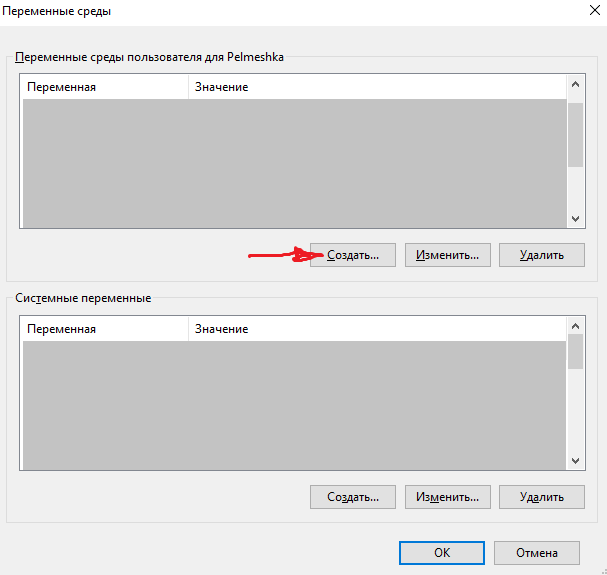
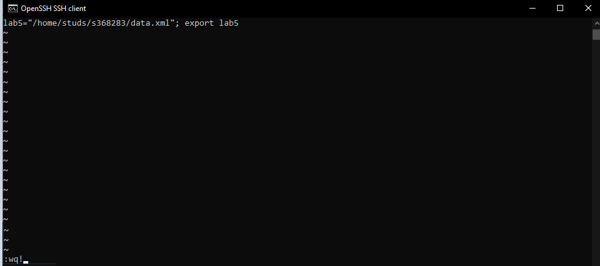

# Лабораторная работа #5
### Номер варианта: _368283_

## Внимание! У разных вариантов разный текст задания!
Реализовать консольное приложение, которое реализует управление коллекцией объектов в интерактивном режиме. В коллекции необходимо хранить объекты класса **Organization**, описание которого приведено ниже.

**Разработанная программа должна удовлетворять следующим требованиям:**
- Класс, коллекцией экземпляров которого управляет программа, должен реализовывать сортировку по умолчанию.
- Все требования к полям класса (указанные в виде комментариев) должны быть выполнены.
- Для хранения необходимо использовать коллекцию типа `java.util.LinkedList`
- При запуске приложения коллекция должна автоматически заполняться значениями из файла.
- Имя файла должно передаваться программе с помощью: `переменная окружения`.
- Данные должны храниться в файле в формате `xml`
- Чтение данных из файла необходимо реализовать с помощью класса `java.util.Scanner`
- Запись данных в файл необходимо реализовать с помощью класса `java.io.BufferedOutputStream`
- Все классы в программе должны быть задокументированы в формате javadoc.
- Программа должна корректно работать с неправильными данными (ошибки пользовательского ввода, отсутсвие прав доступа к файлу и т.п.). 

**В интерактивном режиме программа должна поддерживать выполнение следующих команд:**

- *help* : вывести справку по доступным командам
- *info* : вывести в стандартный поток вывода информацию о коллекции (тип, дата инициализации, количество элементов и т.д.)
- *show* : вывести в стандартный поток вывода все элементы коллекции в строковом представлении
- *add {element}* : добавить новый элемент в коллекцию
- *update id {element}* : обновить значение элемента коллекции, id которого равен заданному
- *remove_by_id id* : удалить элемент из коллекции по его id
- *clear* : очистить коллекцию
- *save* : сохранить коллекцию в файл
- *execute_script file_name* : считать и исполнить скрипт из указанного файла. В скрипте содержатся команды в таком же виде, в котором их вводит пользователь в интерактивном режиме.
- *exit* : завершить программу (без сохранения в файл)
- *remove_first* : удалить первый элемент из коллекции
- *shuffle* : перемешать элементы коллекции в случайном порядке
- *sort* : отсортировать коллекцию в естественном порядке
- *print_descending* : вывести элементы коллекции в порядке убывания
- *print_unique_employees_count* : вывести уникальные значения поля employeesCount всех элементов в коллекции
- *print_field_descending_annual_turnover* : вывести значения поля annualTurnover всех элементов в порядке убывания

**Формат ввода команд:**

- Все аргументы команды, являющиеся стандартными типами данных (примитивные типы, классы-оболочки, String, классы для хранения дат), должны вводиться в той же строке, что и имя команды.
- Все составные типы данных (объекты классов, хранящиеся в коллекции) должны вводиться по одному полю в строку.
- При вводе составных типов данных пользователю должно показываться приглашение к вводу, содержащее имя поля (например, "Введите дату рождения:")
- Если поле является enum'ом, то вводится имя одной из его констант (при этом список констант должен быть предварительно выведен).
- При некорректном пользовательском вводе (введена строка, не являющаяся именем константы в enum'е; введена строка вместо числа; введённое число не входит в указанные границы и т.п.) должно быть показано сообщение об ошибке и предложено повторить ввод поля.
- Для ввода значений null использовать пустую строку.
- Поля с комментарием "Значение этого поля должно генерироваться автоматически" не должны вводиться пользователем вручную при добавлении.

**Описание хранимых в коллекции классов:**

```
public class Organization {
    private Long id; //Поле не может быть null, Значение поля должно быть больше 0, Значение этого поля должно быть уникальным, Значение этого поля должно генерироваться автоматически
    private String name; //Поле не может быть null, Строка не может быть пустой
    private Coordinates coordinates; //Поле не может быть null
    private java.time.ZonedDateTime creationDate; //Поле не может быть null, Значение этого поля должно генерироваться автоматически
    private Float annualTurnover; //Поле не может быть null, Значение поля должно быть больше 0
    private String fullName; //Поле не может быть null
    private long employeesCount; //Значение поля должно быть больше 0
    private OrganizationType type; //Поле не может быть null
    private Address postalAddress; //Поле может быть null
}
public class Coordinates {
    private float x; //Максимальное значение поля: 741
    private Float y; //Поле не может быть null
}
public class Address {
    private String street; //Поле может быть null
}
public enum OrganizationType {
    COMMERCIAL,
    PUBLIC,
    GOVERNMENT,
    TRUST,
    OPEN_JOINT_STOCK_COMPANY;
}
```

**Дополнительные условия:**
1. Использовать паттерн Command.

**Отчёт по работе должен содержать:**
1. Текст задания.
2. Диаграмма классов разработанной программы.
3. Исходный код программы.
4. Выводы по работе.

**Вопросы к защите лабораторной работы:**
1. Коллекции. Сортировка элементов коллекции. Интерфейсы java.util.Comparable и java.util.Comparator.
2. Категории коллекций - списки, множества. Интерфейс java.util.Map и его реализации.
3. Параметризованные типы. Создание параметризуемых классов. Wildcard-параметры.
4. Классы-оболочки. Назначение, область применения, преимущества и недостатки. Автоупаковка и автораспаковка.
5. Потоки ввода-вывода в Java. Байтовые и символьные потоки. "Цепочки" потоков (Stream Chains).
6. Работа с файлами в Java. Класс java.io.File.
7. Пакет java.nio - назначение, основные классы и интерфейсы.
8. Утилита javadoc. Особенности автоматического документирования кода в Java.

## Как создать переменные среды?
### Создаем локально (для Windows)
1. Откройте пуск (клавиша Win) и начните вводить `Изменение системных переменных среды`, затем откройте эти настройки


2. Жмем снизу `Переменные среды...`


3. Создаем новую переменную для пользователя



4. Необходимо указать имя переменной и полный путь __вместе с файлом с коллекцией__ (у меня в лабе имя переменной `lab5`), после нажимаем `OK`


Готово! 

__Примечание.__ Если у вас была открыта idea или терминал, перезапустите их, иначе они не будут видеть переменную окружения

### Создаем на Helios 

1. Подлючаемся к гелиосу
2. Прописываем `vi .bash_profile`, откроется текстовый редактор
3. Здесь прописываем `<имя переменной>="/home/studs/sXXXXXX/<имя файла>"; export <имя переменной>` (чтобы начать писать в виме, нажмите клавишу `i`)

Пример для моей лабы: `lab5="/home/studs/s368283/data.xml"; export lab5`


4. Чтобы сохранить файл и выйти из редактора, надо нажать `Esc` и набрать `:wq` (иногда требуется поставить `!` в конце). Если вы хотите выйти без сохранения наберите `:q!`



__Теперь у вас есть переменная окружения на гелиосе__
