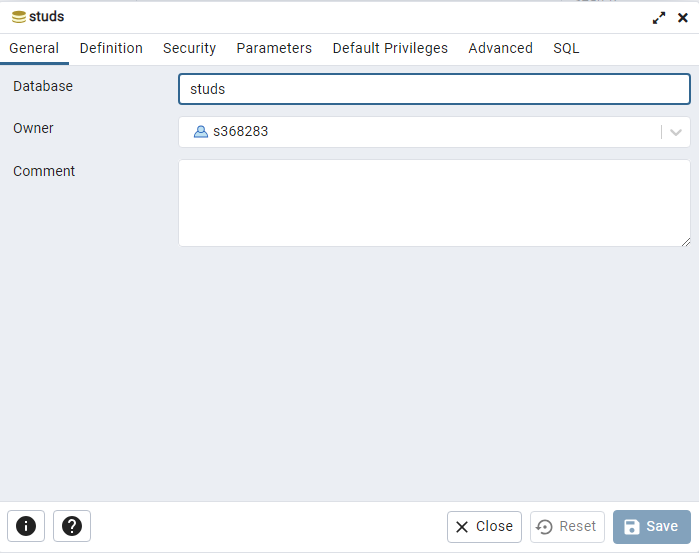

# Лабораторная работа #7
### Номер варианта: _9482394_

## Внимание! У разных вариантов разный текст задания!
Доработать программу из [лабораторной работы №6](https://github.com/CandyGoose/Programming_2_term_SE/tree/main/lab6) следующим образом:
1. Организовать хранение коллекции в реляционной СУБД (PostgresQL). Убрать хранение коллекции в файле.
2. Для генерации поля id использовать средства базы данных (sequence).
3. Обновлять состояние коллекции в памяти только при успешном добавлении объекта в БД
4. Все команды получения данных должны работать с коллекцией в памяти, а не в БД
5. Организовать возможность регистрации и авторизации пользователей. У пользователя есть возможность указать пароль.
6. Пароли при хранении хэшировать алгоритмом `SHA-1`
7. Запретить выполнение команд не авторизованным пользователям.
8. При хранении объектов сохранять информацию о пользователе, который создал этот объект.
9. Пользователи должны иметь возможность просмотра всех объектов коллекции, но модифицировать могут только принадлежащие им.
10. Для идентификации пользователя отправлять логин и пароль с каждым запросом.

Необходимо реализовать многопоточную обработку запросов.
1. Для многопоточного чтения запросов использовать `Fixed thread pool`
2. Для многопотчной обработки полученного запроса использовать `Fixed thread pool`
3. Для многопоточной отправки ответа использовать `Fixed thread pool`
4. Для синхронизации доступа к коллекции использовать `потокобезопасные аналоги коллекции из java.util.concurrent`
   
**Порядок выполнения работы:**
1. В качестве базы данных использовать PostgreSQL.
2. Для подключения к БД на кафедральном сервере использовать хост _pg_, имя базы данных - _studs_, имя пользователя/пароль совпадают с таковыми для подключения к серверу.

**Дополнительные условия:**
1. Использовать Spring DI.

_(Почти такой же вариант, но без спринга: [тык](https://github.com/CandyGoose/Programming_2_term_SE/tree/main/lab7_var2))_

**Отчёт по работе должен содержать:**
1. Текст задания. 
2. Диаграмма классов разработанной программы. 
3. Исходный код программы. 
4. Выводы по работе.

**Вопросы к защите лабораторной работы:**
1. Многопоточность. Класс Thread, интерфейс Runnable. Модификатор synchronized. 
2. Методы wait(), notify() класса Object, интерфейсы Lock и Condition. 
3. Классы-сихронизаторы из пакета java.util.concurrent. 
4. Модификатор volatile. Атомарные типы данных и операции. 
5. Коллекции из пакета java.util.concurrent. 
6. Интерфейсы Executor, ExecutorService, Callable, Future 
7. Пулы потоков 
8. JDBC. Порядок взаимодействия с базой данных. Класс DriverManager. Интерфейс Connection 
9. Интерфейсы Statement, PreparedStatement, ResultSet, RowSet 
10. Шаблоны проектирования.

## Примечание

Я использую переменные окружения для подключения к БД.

Подробнее о том, как их создавать рассказано [здесь](https://github.com/CandyGoose/Programming_2_term_SE/tree/main/lab5) ниже описания лабораторной

Еще на гелиосе в директории, откуда запускается джарник сервера, надо создать папку `logs` с файлом `log.log`, чтобы сервер не ругался на логгер.
## Как создать локальную базу данных, чтобы не тестировать на Helios?
1. Скачайте и установите [PostgreSQL](https://www.enterprisedb.com/downloads/postgres-postgresql-downloads)

**При установке обязательно выберите `PostreSQL Server` и `pgAdmin4`**, далее придумываем пароль, а все остальное не трогаем и оставляем по умолчанию

2. Откройте `pgAdmin`

**Примечание.** если у вас возникает такое окно при открытии pgAdmin, попробуйте установить его другую версию с [сайта](https://www.pgadmin.org/download/)

3. Вас встретит окно, где надо ввести пароль из 1 пункта

4. Разверните вкладку PostgreSQL 15 слева и нажмите ПКМ по `Login/Group Roles - Create - Login/Group Role...`

5. Повторите настройки:
- General
   - Name: `sXXXXXX` (XXXXXX - ИСУ)
- Definition
   - Password: пароль из файла .pgpass (чтобы его получить подключитесь к гелиосу и пропишите `cat .pgpass`, там будет "\*:\*:\*\:sXXXXXX:пароль") 
- Privileges
   - Включите всё

Нажмите `Save`

6. Нажмите ПКМ по `Databases - Create - Database...`

7. Повторите настройки:
- General
   - Database: `studs`
   - Owner: `sXXXXXX` (XXXXXX - ИСУ)

Нажмите `Save`

__Теперь можно запускать jar локально без подлючения к Helios с такими же данными (название БД, логин и пароль)__

8. Настроим доступ к БД в idea, для этого открываем проект, справа будет кнопка `Database`, после чего нажимаем на `+`, далее `Data Source - PostgreSQL`

9. В открывшемся окне опять жмем `+`, нажимаем `Download` внизу, если требуется, и вводим данные:

- User: `sXXXXXX`
- Password: пароль из файла .pgpass (см. 5 пункт)
- Database: `studs`

10. Жмем `Apply`, а потом `Test Connection`, должно появиться примерно такое окно (не ошибка):

Теперь мы можем прямо в idea отслеживать изменения БД, выполнять sql запросы и даже дропать таблицы при необходимости 

__Всё это облегчает тестирование лабы, а что самое важное, потом при загрузке jar на гелиос не придется специально переделывать данные в проперти файлах, переменных окружения и тд.__
