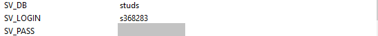

# Лабораторные работы 5-7
### Номер варианта: _369074_

## Внимание! У разных вариантов разный текст задания!
Реализовать консольное приложение, которое реализует управление коллекцией объектов в интерактивном режиме. В коллекции необходимо хранить объекты класса `Person`, описание которого приведено ниже.

__Разработанная программа должна удовлетворять следующим требованиям:__

- Класс, коллекцией экземпляров которого управляет программа, должен реализовывать сортировку по умолчанию.
- Все требования к полям класса (указанные в виде комментариев) должны быть выполнены.
- Для хранения необходимо использовать коллекцию типа `java.util.LinkedList`
- При запуске приложения коллекция должна автоматически заполняться значениями из файла.
- Все классы в программе должны быть задокументированы в формате javadoc.
- Программа должна корректно работать с неправильными данными (ошибки пользовательского ввода, отсутсвие прав доступа к файлу и т.п.).

__В интерактивном режиме программа должна поддерживать выполнение следующих команд:__
- _help_ : вывести справку по доступным командам
- _info_ : вывести в стандартный поток вывода информацию о коллекции (тип, дата инициализации, количество элементов и т.д.)
- _show_ : вывести в стандартный поток вывода все элементы коллекции в строковом представлении
- _add {element}_ : добавить новый элемент в коллекцию
- _update id {element}_ : обновить значение элемента коллекции, id которого равен заданному
- _remove_by_id id_ : удалить элемент из коллекции по его id
- _clear_ : очистить коллекцию
- _save_ : сохранить коллекцию в файл
- _execute_script file_name_ : считать и исполнить скрипт из указанного файла. В скрипте содержатся команды в таком же виде, в котором их вводит пользователь в интерактивном режиме.
- _exit_ : завершить программу (без сохранения в файл)
- _remove_first_ : удалить первый элемент из коллекции
- _head_ : вывести первый элемент коллекции
- _history_ : вывести последние 14 команд (без их аргументов)
- _remove_any_by_hair_color hairColor_ : удалить из коллекции один элемент, значение поля hairColor которого эквивалентно заданному
- _average_of_height_ : вывести среднее значение поля height для всех элементов коллекции
- _filter_starts_with_name name_ : вывести элементы, значение поля name которых начинается с заданной подстроки

__Формат ввода команд:__

- Все аргументы команды, являющиеся стандартными типами данных (примитивные типы, классы-оболочки, String, классы для хранения дат), должны вводиться в той же строке, что и имя команды.
- Все составные типы данных (объекты классов, хранящиеся в коллекции) должны вводиться по одному полю в строку.
- При вводе составных типов данных пользователю должно показываться приглашение к вводу, содержащее имя поля (например, "Введите дату рождения:")
- Если поле является enum'ом, то вводится имя одной из его констант (при этом список констант должен быть предварительно выведен).
- При некорректном пользовательском вводе (введена строка, не являющаяся именем константы в enum'е; введена строка вместо числа; введённое число не входит в указанные границы и т.п.) должно быть показано сообщение об ошибке и предложено повторить ввод поля.
- Для ввода значений null использовать пустую строку.
- Поля с комментарием "Значение этого поля должно генерироваться автоматически" не должны вводиться пользователем вручную при добавлении.

__Описание хранимых в коллекции классов:__

```
public class Person {
    private Integer id; //Поле не может быть null, Значение поля должно быть больше 0, Значение этого поля должно быть уникальным, Значение этого поля должно генерироваться автоматически
    private String name; //Поле не может быть null, Строка не может быть пустой
    private Coordinates coordinates; //Поле не может быть null
    private java.time.ZonedDateTime creationDate; //Поле не может быть null, Значение этого поля должно генерироваться автоматически
    private Float height; //Поле не может быть null, Значение поля должно быть больше 0
    private Color eyeColor; //Поле не может быть null
    private Color hairColor; //Поле может быть null
    private Country nationality; //Поле не может быть null
    private Location location; //Поле может быть null
}
public class Coordinates {
    private float x;
    private float y;
}
public class Location {
    private Double x; //Поле не может быть null
    private int y;
    private double z;
}
public enum Color {
    RED,
    BLACK,
    ORANGE;
}
public enum Color {
    GREEN,
    RED,
    YELLOW,
    ORANGE,
    BROWN;
}
public enum Country {
    CHINA,
    INDIA,
    THAILAND,
    SOUTH_KOREA;
}
```

Серверный модуль должен осуществлять выполнение команд по управлению коллекцией. Клиентский модуль должен в интерактивном режиме считывать команды, передавать их для выполнения на сервер и выводить результаты выполнения.

__Необходимо выполнить следующие требования:__
- Операции обработки объектов коллекции должны быть реализованы с помощью Stream API с использованием лямбда-выражений.
- Объекты между клиентом и сервером должны передаваться в сериализованном виде.
- Объекты в коллекции, передаваемой клиенту, должны быть отсортированы по `местоположению`
- Клиент должен корректно обрабатывать временную недоступность сервера.
- Обмен данными между клиентом и сервером должен осуществляться по протоколу `TCP`
- Для обмена данными на сервере необходимо использовать `потоки ввода-вывода`
- Для обмена данными на клиенте необходимо использовать `сетевой канал`
- Сетевые каналы должны использоваться в неблокирующем режиме.

__Обязанности серверного приложения:__
- Управление коллекцией объектов.
- Назначение автоматически генерируемых полей объектов в коллекции.
- Ожидание подключений и запросов от клиента.
- Обработка полученных запросов (команд).

__Серверное приложение должно состоять из следующих модулей (реализованных в виде одного или нескольких классов):__
- Модуль приёма подключений.
- Модуль чтения запроса.
- Модуль обработки полученных команд.
- Модуль отправки ответов клиенту.

__Обязанности клиентского приложения:__
- Чтение команд из консоли.
- Валидация вводимых данных.
- Сериализация введённой команды и её аргументов.
- Отправка полученной команды и её аргументов на сервер.
- Обработка ответа от сервера (вывод результата исполнения команды в консоль).
- Команда exit завершает работу клиентского приложения.

__Важно!__ Команды и их аргументы должны представлять из себя объекты классов. Недопустим обмен "простыми" строками. Так, для команды add или её аналога необходимо сформировать объект, содержащий тип команды и объект, который должен храниться в вашей коллекции.

__Дополнительное задание:__

Реализовать логирование различных этапов работы сервера (начало работы, получение нового подключения, получение нового запроса, отправка ответа и т.п.) с помощью `Logback`

Доработать программу следующим образом:
1. Организовать хранение коллекции в реляционной СУБД (PostgresQL). Убрать хранение коллекции в файле.
2. Для генерации поля id использовать средства базы данных (sequence).
3. Обновлять состояние коллекции в памяти только при успешном добавлении объекта в БД
4. Все команды получения данных должны работать с коллекцией в памяти, а не в БД
5. Организовать возможность регистрации и авторизации пользователей. У пользователя есть возможность указать пароль.
6. Пароли при хранении хэшировать алгоритмом `SHA-512`
7. Запретить выполнение команд не авторизованным пользователям.
8. При хранении объектов сохранять информацию о пользователе, который создал этот объект.
9. Пользователи должны иметь возможность просмотра всех объектов коллекции, но модифицировать могут только принадлежащие им.
10. Для идентификации пользователя отправлять логин и пароль с каждым запросом. 

__Необходимо реализовать многопоточную обработку запросов.__

1. Для многопоточного чтения запросов использовать `ForkJoinPool`
2. Для многопотчной обработки полученного запроса использовать `Cached thread pool`
3. Для многопоточной отправки ответа использовать `создание нового потока (java.lang.Thread)`
4. Для синхронизации доступа к коллекции использовать `потокобезопасные аналоги коллекции из java.util.concurrent`

__Порядок выполнения работы:__

В качестве базы данных использовать PostgreSQL.
Для подключения к БД на кафедральном сервере использовать хост _pg_, имя базы данных - _studs_, имя пользователя/пароль совпадают с таковыми для подключения к серверу.

## Примечание

Я использую переменные окружения для подключения к БД.



Подробнее о том, как их создавать рассказано [здесь](https://github.com/CandyGoose/Programming_2_term_SE/tree/main/lab5) ниже описания лабораторной

Еще на гелиосе в директории, откуда запускается джарник сервера, надо создать папку `logs` с файлом `log.log`, чтобы сервер не ругался на логгер.
