# Лабораторная работа #8
### Номер варианта: _438943_

## Внимание! У разных вариантов разный текст задания!
1. Интерфейс должен быть реализован с помощью библиотеки JavaFX 
2. Графический интерфейс клиентской части должен поддерживать `русский`, `румынский`, `венгерский` и `английский (Индия)` языки / локали. Должно обеспечиваться корректное отображение чисел, даты и времени в соответстии с локалью. Переключение языков должно происходить без перезапуска приложения. Локализованные ресурсы должны храниться в `классе`.

Доработать программу из [лабораторной работы №7](https://github.com/CandyGoose/Programming_2_term_SE/tree/main/lab7) следующим образом:

Заменить консольный клиент на клиент с графическим интерфейсом пользователя(GUI).

В функционал клиента должно входить:
Необходимо реализовать многопоточную обработку запросов.
1. Окно с авторизацией/регистрацией.
2. Отображение текущего пользователя.
3. Таблица, отображающая все объекты из коллекции 
   1. Каждое поле объекта - отдельная колонка таблицы. 
   2. Строки таблицы можно фильтровать/сортировать по значениям любой из колонок. Сортировку и фильтрацию значений столбцов реализовать с помощью Streams API. 
4. Поддержка всех команд из предыдущих лабораторных работ. 
5. Область, визуализирующую объекты коллекции
   1. Объекты должны быть нарисованы с помощью графических примитивов с использованием Graphics, Canvas или аналогичных средств графической библиотеки.
   2. При визуализации использовать данные о координатах и размерах объекта.
   3. Объекты от разных пользователей должны быть нарисованы разными цветами.
   4. При нажатии на объект должна выводиться информация об этом объекте.
   5. При добавлении/удалении/изменении объекта, он должен **автоматически** появиться/исчезнуть/измениться  на области как владельца, так и всех других клиентов.
   6. При отрисовке объекта должна воспроизводиться согласованная с преподавателем **анимация**.
6. Возможность редактирования отдельных полей любого из объектов (принадлежащего пользователю). Переход к редактированию объекта возможен из таблицы с общим списком объектов и из области с визуализацией объекта.
7. Возможность удаления выбранного объекта (даже если команды remove ранее не было). 

Перед непосредственной разработкой приложения **необходимо** согласовать прототип интерфейса с преподавателем. Прототип интерфейса должен быть создан с помощью средства для построения прототипов интерфейсов(mockplus, draw.io, etc.)

**Вопросы к защите лабораторной работы:**
1. Компоненты пользовательского интерфейса. Иерархия компонентов.
2. Базовые классы Component, Container, JComponent.
3. Менеджеры компоновки.
4. Модель обработки событий. Класс-слушатель и класс-событие.
5. Технология JavaFX. Особенности архитектуры, отличия от AWT / Swing.
6. Интернационализация. Локализация. Хранение локализованных ресурсов.
7. Форматирование локализованных числовых данных, текста, даты и времени. Классы NumberFormat, DateFormat, MessageFormat, ChoiceFormat.


## Интерфейс

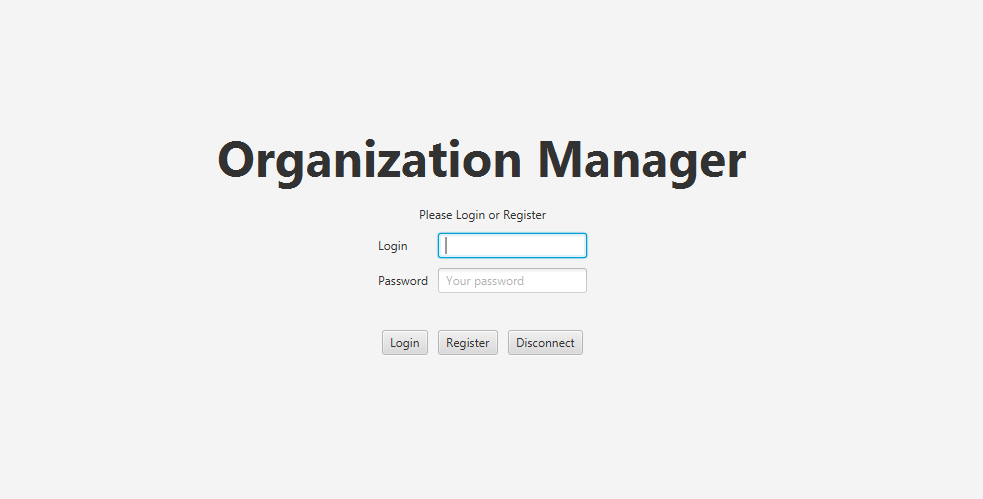

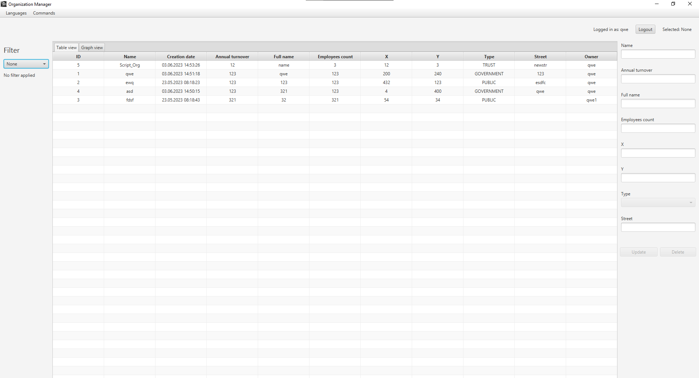

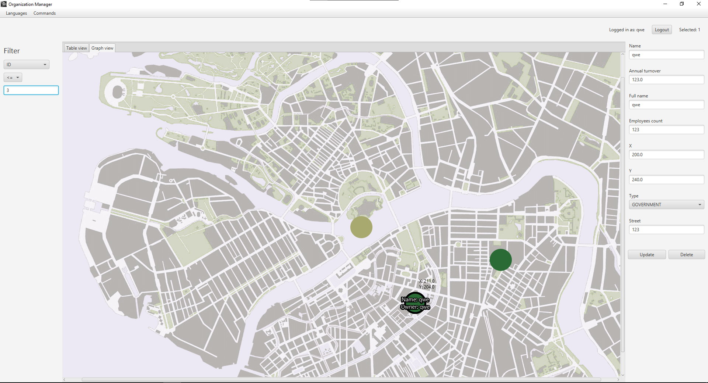

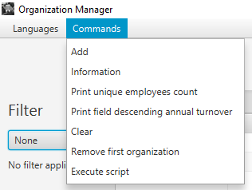

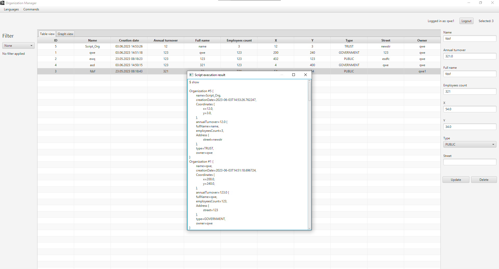

## Примечания
### Как пробросить порты?

Подключитесь к Helios, используя команду
```
ssh -L <локальный порт>:localhost:<порт сервера> sXXXXXX@helios.cs.ifmo.ru -p 2222
```

Пример для моей лабы:
```
ssh -L 65435:localhost:65435 s368283@helios.cs.ifmo.ru -p 2222
```

Готово!

### Ошибка JavaFX
Если у вас при запуске клиента из idea возникает следующая ошибка: 

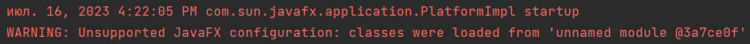

Необходимо выполнить следующие шаги:

1. Скачать с [сайта](https://gluonhq.com/products/javafx/) sdk

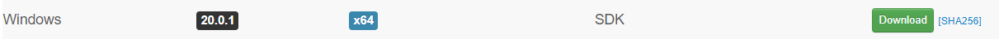

2. Распаковать архив в удобную папку
3. Найти в idea `Edit Configurations`

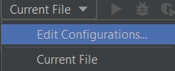

4. Создать конфигурацию, если у вас ее еще нет

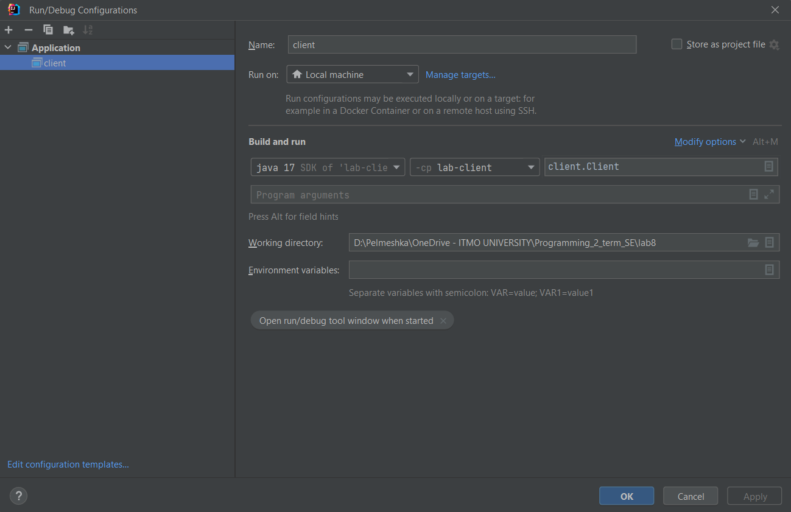

5. В этом же окне нажать на `Modify options`, чтобы раскрылось меню, и выбрать `Add VM options`

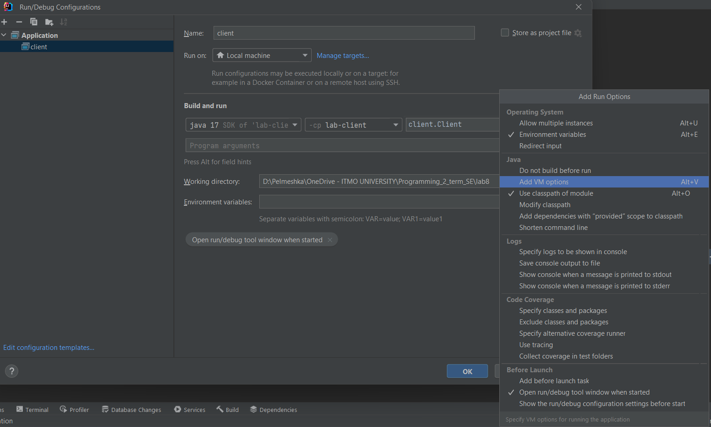

6. В появившемся окне прописать:

``` --module-path "<полный путь до распакованного архива>\javafx-sdk-<версия>\lib" --add-modules javafx.controls,javafx.fxml -Dprism.order=sw ```

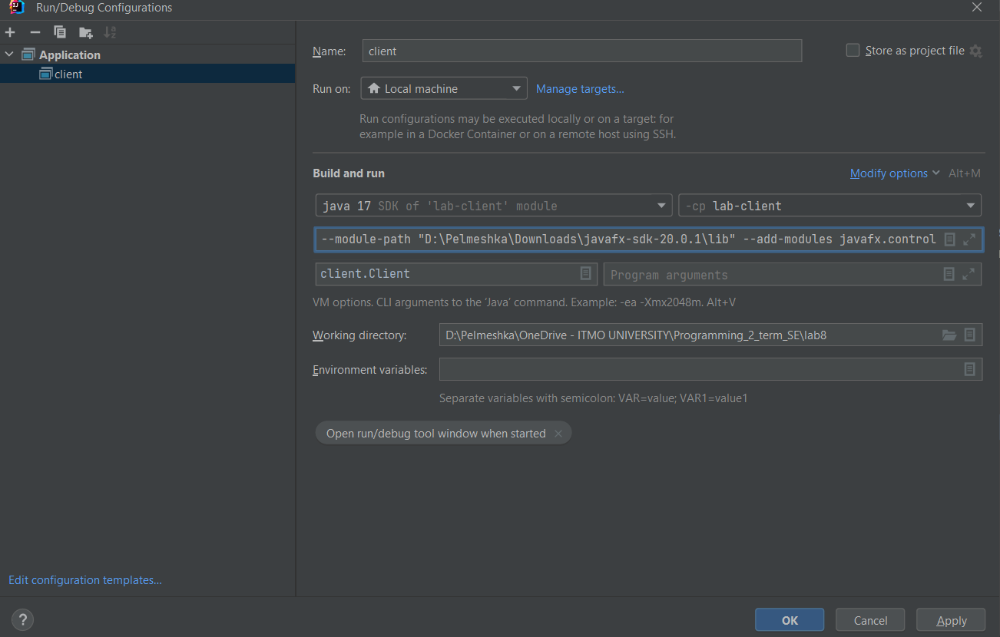

7. Нажать `Apply`, теперь сверху появится конфигурация, запуская которую по зеленой стрелочке, вы больше не будете получать ошибку

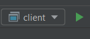

### Ошибка при авторизации `Login or password is incorrect`


1. Неправильный пароль
2. Устаревшая таблица БД `users`, которую необходимо создать заново
- Подключаемся к Helios
- Прописываем `touch drop.sql`, затем `vi drop.sql`, откроется текстовый редактор
- Здесь пишем `drop table users;` и сохраняем, нажимая `Esc` и прописывая `:wq!` (или `:q!`, если вам надо выйти без изменений)
- Прописываем `psql -h pg -d studs`, а после `\i drop.sql`, это удалит таблицу `users`
- Запускаем сервер, после этого всё должно заработать (правда клиентам надо заново регистрироваться)
3. Если ничего не помогло, ошибка где-то еще